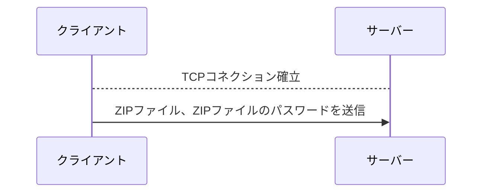
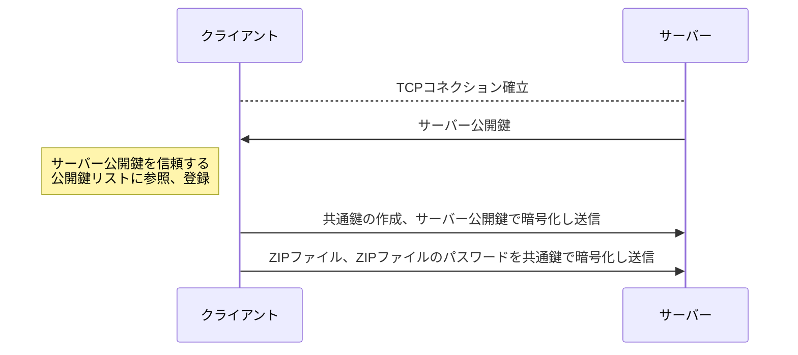

# PPAP
## Requirements
Python 3.10+  

## Installation
1. リポジトリのクローン
```
$ git clone https://github.com/SakashimaHouse/PPAP.git
$ cd ./PPAP
```
2. 依存関係のインストール
```
$ pip install -r requirements.txt
```

## Usage
1. サーバーの起動
```
$ python PPAP_Server.py -s

```
2. パスワード付きZIPファイルを作成
```
$ sudo apt-get install zip -y
$ mkdir example
$ zip --encrypt -password P@ssw0rd ./example.zip ./example
```
3. ファイルの送信
```
$ python PPAP_Client.py -i "./example.zip" -t 127.0.0.1 -s
```

## Logic
### PPAP (非暗号化プロトコル)


### PPAPS (暗号化プロトコル)


## License
このプロジェクトはMIT Licenseに基づきライセンスされています